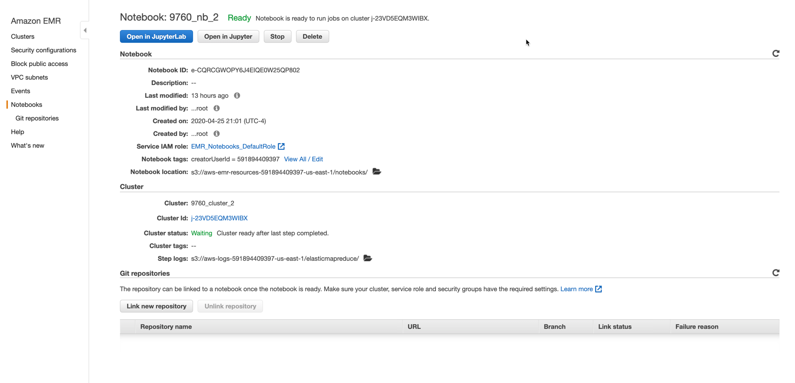

# Analyzing 10Gb of Yelp Reviews Data

The Yelp dataset used in this analysis is from Kaggle: 

https://www.kaggle.com/yelp-dataset/yelp-dataset

The data, which consists of several `json` files, have been published to an `AWS S3 bucket`.

- `yelp_academic_dataset_business.json`

  - https://9760-spark-data.s3.amazonaws.com/yelp_academic_dataset_business.json
  
- `yelp_academic_dataset_user.json`

  - https://9760-spark-data.s3.amazonaws.com/yelp_academic_dataset_user.json

- `yelp_academic_dataset_review.json`

  - https://9760-spark-data.s3.amazonaws.com/yelp_academic_dataset_review.json

## Goals:

- Provision a Spark cluster on AWS EMR

- Connect the cluster to a Jupyter Notebook

- Run a series of queries in PySpark that answer a few simple questions about the Yelp Data available

## EMR Cluster Configuration 

## Notebook Configuration

### `Analysis.ipynb` Notebook

- **Part I**: Installation and Initial Setup

- **Part II**:  Analyzing Categories

- **Part III**: Do Yelp Reviews Skew Negative?

- **Part IV**: Should the Elite be Trusted?

